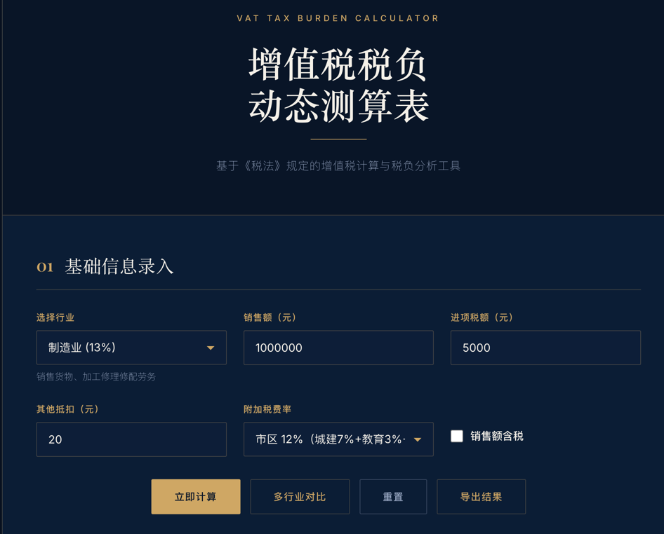
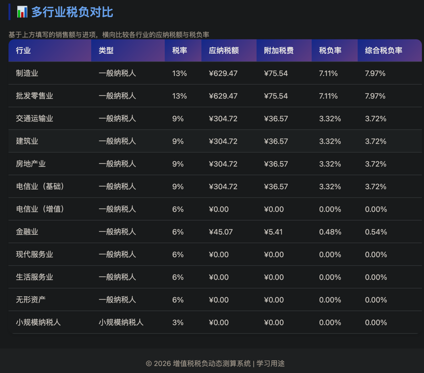
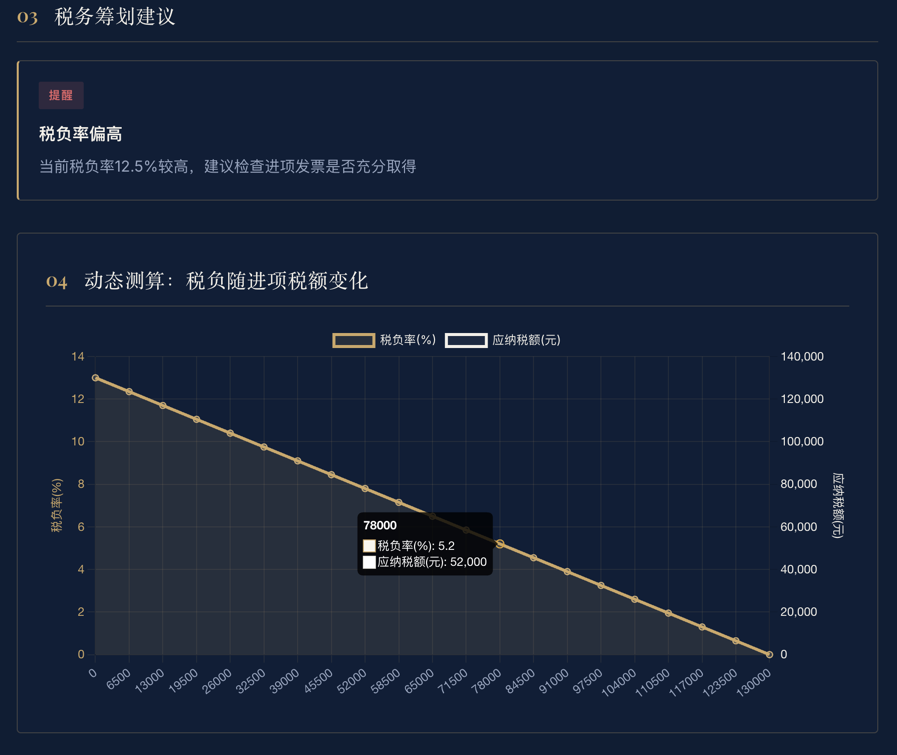

# 增值税税负动态测算系统


> 📚 本工具为 **CPA 中税法备考**的配套练手项目：把税法知识点做成可运行的小工具。
> 结果仅供参考，实际纳税请咨询专业税务师，并以最新税法为准。

## 📸 效果预览

| 主界面                               | 多行业对比                                  | 税负曲线                                |
|-----------------------------------|----------------------------------------|-------------------------------------|
|  |  |  |

> 🔗 在线 Demo：https://evey.pythonanywhere.com/
> 截图占位：将实际截图放入 `docs/screenshots/`（见 `docs/article-draft.md` 第 5 节）。
> 部署说明见 [DEPLOY.md](DEPLOY.md)。

## 📋 项目简介

这是一个基于《税法》规定的增值税计算与税负分析工具，支持多行业税率选择、自动计算增值税应纳税额和税负率，并提供税务筹划建议。

## ✨ 核心功能

### 1. 行业税率管理
- 支持12种常见行业（制造业、批发零售、交通运输、建筑、房地产等）
- 区分一般纳税人和小规模纳税人
- 自动匹配适用税率（13%、9%、6%、3%）

### 2. 动态计算
- 实时计算销项税额、进项税额、应纳税额
- 自动计算税负率
- 支持含税/不含税销售额输入
- 支持其他抵扣项
- **小规模征收率下拉**：可选 1% / 3% / 5%，自动适配不同业务场景
- **附加税费**：按城建税+教育费附加+地方教育费附加（默认 12%）自动计算，并汇总得出**综合税负率**

### 3. 优惠政策支持
- **加计抵减**：现代服务业、生活服务业、电信增值、无形资产等行业可享 10% / 15% 加计抵减，以进项税额为基数，超出部分可结转
- **小规模免税起征点**：支持月 10 万 / 季 30 万 / 不享受三档，未超起征点免征增值税
- 税务筹划建议会根据所选政策动态生成

### 4. 智能分析
- 税负率异常提醒（偏高/偏低）
- 留抵税额提示
- 进项发票管理建议
- 税务风险预警

### 5. 多行业对比表
- 输入销售额与进项后，一键横向对比多个行业的应纳税额与综合税负率
- 帮助纳税人直观选择税负更优的行业定位或纳税身份

### 6. 可视化展示
- 清晰的结果卡片展示
- **Chart.js 动态图表**：展示各情景/各行业的税负对比曲线（需联网加载 CDN）
- 计算公式说明
- 响应式设计，支持移动端
- **CSV 导出**：一键导出当前测算结果（带 BOM，Excel 中文不乱码）

## 🛠️ 技术栈

- **后端**: Python + Flask
- **前端**: HTML5 + CSS3 + JavaScript
- **数据格式**: JSON配置
- **UI设计**: 深海军蓝 + 骨白 + 金色的机构感风格（衬线标题、细线分隔）

## 📦 安装步骤

### 1. 进入项目目录
```bash
cd vat_calculator
```

### 2. 创建虚拟环境（推荐）
```bash
python -m venv venv
source venv/bin/activate  # macOS/Linux
# 或
venv\Scripts\activate     # Windows
```

### 3. 安装依赖
```bash
pip install -r requirements.txt
```

## 🚀 启动应用

```bash
python app.py
```

访问浏览器：**http://127.0.0.1:5000**

## 📖 使用指南

### 基本操作流程

1. **选择行业**：从下拉菜单选择所属行业
   - 系统会自动显示该行业的税率和描述
   - 小规模纳税人无需填写进项税额

2. **输入销售额**：填写本期销售金额
   - 可选择是否含税
   - 支持小数点后两位

3. **填写进项税额**（一般纳税人）
   - 填写取得的增值税专用发票税额
   - 可填写其他抵扣项

4. **（可选）配置税费与优惠政策**
   - **征收率**：小规模纳税人可下拉选择 1% / 3% / 5%
   - **附加税费率**：默认 12%，可按本地实际比例修改
   - **加计抵减**：适用行业可下拉选择 10% / 15%
   - **免税起征点**：小规模可选月 10 万 / 季 30 万 / 不享受

5. **点击计算**：系统自动计算并展示结果
   - 应纳税额、附加税费、综合税负率
   - 加计抵减明细（本期抵减额 / 结转额）
   - 税务筹划建议

6. **导出结果**：点击"导出 CSV"保存当前测算明细

### 多行业对比表用法

1. 在页面底部"多行业对比"区域填写**销售额**与**进项税额**（含税/不含税开关与主计算联动）
2. 勾选需要对比的行业（默认全选），点击"生成对比表"
3. 系统会横向列出每个行业的：
   - 适用税率 / 征收率
   - 应纳税额
   - 附加税费
   - **综合税负率**
4. 综合税负率最低的行业，通常代表在给定销售额下的相对最优纳税定位
5. 结果同样可"导出 CSV"用于汇报或存档

### 计算示例

#### 示例1：制造业一般纳税人
- 行业：制造业（13%）
- 销售额：1,000,000元（不含税）
- 进项税额：100,000元
- **应纳税额** = 1,000,000 × 13% - 100,000 = **30,000元**
- **税负率** = 30,000 ÷ 1,000,000 × 100% = **3%**

#### 示例2：小规模纳税人
- 行业：小规模纳税人（3%）
- 销售额：500,000元
- **应纳税额** = 500,000 × 3% = **15,000元**
- **税负率** = **3%**（固定）

## 📊 行业税率表

| 行业 | 税率 | 适用范围 |
|------|------|----------|
| 制造业 | 13% | 销售货物、加工修理修配劳务 |
| 批发零售业 | 13% | 商品批发和零售 |
| 交通运输业 | 9% | 陆路、水路、航空运输服务 |
| 建筑业 | 9% | 建筑安装、装饰装修 |
| 房地产业 | 9% | 房地产开发、销售 |
| 电信业（基础） | 9% | 基础电信服务 |
| 电信业（增值） | 6% | 增值电信服务 |
| 金融业 | 6% | 贷款、保险、金融商品转让 |
| 现代服务业 | 6% | 研发、信息技术、文化创意等 |
| 生活服务业 | 6% | 餐饮、住宿、教育、医疗等 |
| 无形资产 | 6% | 技术转让、商标著作权等 |
| 小规模纳税人 | 3% | 年销售额500万以下 |

## 🔧 API接口

### 1. 获取行业列表
```
GET /api/industries
```

**返回示例：**
```json
{
  "success": true,
  "industries": [
    {
      "id": "manufacturing",
      "name": "制造业",
      "taxpayer_type": "general",
      "output_rate": 0.13,
      "description": "销售货物、加工修理修配劳务"
    }
  ]
}
```

### 2. 计算增值税
```
POST /api/calculate
```

**请求体：**
```json
{
  "industry_id": "manufacturing",
  "sales_amount": 1000000,
  "input_tax": 100000,
  "other_deductions": 0,
  "is_tax_inclusive": false,
  "levy_rate": null,
  "additional_tax_rate": 0.12,
  "additional_deduction_rate": 0.0,
  "exemption_threshold": 100000
}
```

**返回示例：**
```json
{
  "success": true,
  "result": {
    "industry_name": "制造业",
    "taxpayer_type": "一般纳税人",
    "tax_rate": 0.13,
    "sales_amount": 1000000.00,
    "output_tax": 130000.00,
    "input_tax": 100000.00,
    "vat_payable": 30000.00,
    "additional_deduction_rate": 0.0,
    "additional_deduction_amount": 0.0,
    "additional_deduction_carry": 0.0,
    "surcharge": 3600.00,
    "total_tax": 33600.00,
    "tax_burden_rate": 3.00,
    "composite_tax_burden_rate": 3.36
  },
  "suggestions": []
}
```

### 3. 多行业对比
```
POST /api/compare
```

**请求体：**
```json
{
  "sales_amount": 1000000,
  "input_tax": 100000,
  "is_tax_inclusive": false,
  "additional_tax_rate": 0.12,
  "exemption_threshold": 100000,
  "industry_ids": ["manufacturing", "modern_service", "small_scale"]
}
```

**返回示例：**
```json
{
  "success": true,
  "comparison": [
    {
      "industry_id": "manufacturing",
      "industry_name": "制造业",
      "taxpayer_type": "一般纳税人",
      "tax_rate": 0.13,
      "vat_payable": 30000.00,
      "surcharge": 3600.00,
      "composite_tax_burden_rate": 3.36
    }
  ]
}
```

## 📝 计算公式

### 一般纳税人
- **销项税额** = 销售额 × 税率
- **加计抵减额** = 进项税额 × 加计抵减率（不超过应纳税额，超出结转）
- **应纳税额** = 销项税额 - 进项税额 - 其他抵扣 - 加计抵减
- **附加税费** = 应纳税额 × 附加税费率（应纳税额>0 时计征）
- **税负率** = 应纳税额 ÷ 销售额 × 100%
- **综合税负率** = (应纳税额 + 附加税费) ÷ 销售额 × 100%

### 小规模纳税人
- **应纳税额** = 销售额 × 征收率
- **不得抵扣进项税额**
- **免税**：未超过起征点（月 10 万 / 季 30 万）时应纳税额 = 0
- **附加税费** = 应纳税额 × 附加税费率（同一般纳税人逻辑）

## 💡 税务筹划要点

1. **合理取得进项发票**
   - 采购时优先选择能开具专票的供应商
   - 及时索取并认证进项发票

2. **关注税负率异常**
   - 税负率过高：检查是否有未取得的进项发票
   - 税负率过低：保持合理进销项比例，防范税务风险

3. **利用税收优惠政策**
   - 小规模纳税人享受减免政策（起征点免征）
   - 特定行业加计抵减政策（10% / 15%）
   - 多行业对比选择最优纳税身份

## ⚠️ 注意事项

1. 本工具仅供学习参考，实际纳税请咨询专业税务师
2. 税率政策可能调整，请以最新税法为准
3. 小规模纳税人2023年有阶段性优惠政策（1%），可根据实际情况调整配置

## 📁 项目结构

```
vat_calculator/
├── app.py                  # Flask主应用
├── calculator.py           # 核心计算逻辑
├── requirements.txt        # 依赖包（含 gunicorn）
├── Procfile                # 云部署入口（gunicorn）
├── runtime.txt             # Python 版本声明
├── README.md              # 项目文档
├── DEPLOY.md              # 公网部署说明
├── docs/
│   ├── article-draft.md    # 文章底稿（存档）
│   └── screenshots/        # 效果截图（占位）
├── data/
│   └── industry_rates.json # 行业税率配置
├── templates/
│   └── index.html         # 主页模板
├── static/
│   ├── css/
│   │   └── style.css      # 样式文件
│   └── js/
│       └── app.js         # 前端交互逻辑
└── tests/
    └── test_calculator.py # 单元测试（pytest）
```

## 🧪 单元测试

项目内置 `tests/test_calculator.py`，覆盖加计抵减、免税起征点、多行业对比、含税换算等场景。

```bash
# 安装测试依赖后运行
pip install -r requirements.txt
pytest tests/ -v
```

## 🎯 学习价值

通过本项目可以学习：
- ✅ 增值税的基本原理和计算方法
- ✅ 不同行业的税率差异
- ✅ 一般纳税人与小规模纳税人的区别
- ✅ 税负率与综合税负率的含义和分析方法
- ✅ 加计抵减、免税起征点等优惠政策建模
- ✅ 多行业横向对比的税务筹划思路
- ✅ Flask Web应用开发与 RESTful API 设计
- ✅ 前端 Chart.js 可视化与 CSV 导出

## 📄 开源协议

本项目仅供学习使用。

---

**祝您学习愉快！** 🎓
